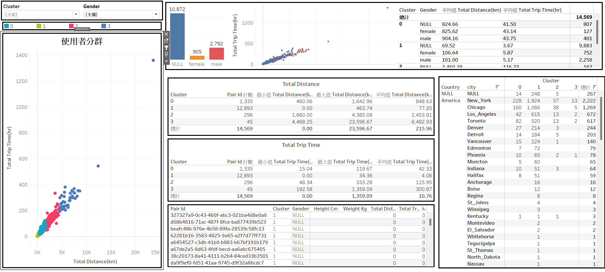

## Python Analysis Workflow

1. **Flatten All JSON Files**  
   Import and flatten all JSON files to ensure that the data is structured appropriately for subsequent processing.

2. **Data Cleaning**  
   Remove entries without a `pair_id` and filter out any anomalous or incomplete data to maintain the quality of the dataset.

3. **K-means Clustering Analysis**  
   Use PySpark to analyze the latitude and longitude columns, identifying the optimal K value for K-means clustering using methods such as the elbow method or silhouette scores.

4. **Execute K-means Clustering**  
   After determining the optimal K value, apply K-means clustering to the latitude and longitude data.

5. **Test with Multiple Random Seeds**  
   Set 5 different random seeds for K-means clustering, then manually evaluate which seed provides the most suitable clustering results for the current analysis.

6. **Group by Pair ID to Identify Cluster Centers**  
   Once the target clusters are identified, group the data by `pair_id` and use K-means clustering to find four center points within each group.

7. **Export Results to a CSV File**  
   Output the results of the analysis to a CSV file for further analysis and visualization.

## Tableau Visualization Workflow

1. **Data Import**  
   Import the latitude/longitude table, user profile table, and brand table into Tableau, preparing for mapping and further analysis.

2. **Key User Analysis**
   
   Identify key users, specifically those in the second and third clusters, and perform the following analyses:
   - **Brand Distribution**: Determine the distribution of brands among different user clusters.
   - **User Distance**: Analyze the distances between key users and brands to understand their geographic distribution.
3.  **Mapping and Analysis**  
   Map the latitude and longitude data on a geographic map using Tableau's visualization tools to derive actionable insights from the spatial analysis.

---

## Python 分析流程

1. **展開所有 JSON 檔案**  
   將所有 JSON 檔案讀入並展開結構，確保所有數據都以適當的形式呈現，方便後續處理。

2. **資料清理**  
   剔除沒有 `pair_id` 的數據，以及異常或不完整的數據，以確保資料集的質量。

3. **K-means 聚類分析**  
   使用 PySpark 分析經緯度兩個欄位，通過肘部法則或輪廓系數等方法找出 K-means 聚類的最佳 K 值。

4. **執行 K-means 聚類**  
   確定最佳 K 值後，將經緯度資料帶入 K-means 聚類模型中進行分析。

5. **多種隨機種子測試**  
   設定 5 個不同的隨機種子，進行 K-means 聚類，並進行人工比對，以辨別哪個隨機種子下的聚類結果最適合現況分析。

6. **基於 Pair ID 分組找出中心點**  
   在確定目標 cluster 後，以 `pair_id` 為群組，透過 K-means 聚類找出每個群組內的四個中心點。

7. **產出 CSV 檔案**  
   將分析結果輸出為 CSV 檔案，以便後續分析和可視化處理。

## Tableau 視覺化流程

1. **資料匯入**  
   將經緯度表、用戶 Profile 表和品牌資料表匯入 Tableau 中，為進一步的地圖繪製和分析做好準備。

2. **關鍵使用者分析**  
   分類出關鍵使用者，特別是第二群和第三群使用者，並進行以下分析：
   - **品牌分布**：找出各品牌在不同使用者群組中的分布情況。
   - **使用者距離**：分析關鍵使用者與品牌的距離，了解其地理分布特徵。
3. **地圖繪製與分析**  
   將經緯度資料映射到地圖中，使用 Tableau 的可視化功能進行地理空間分析，得出分析結果。

